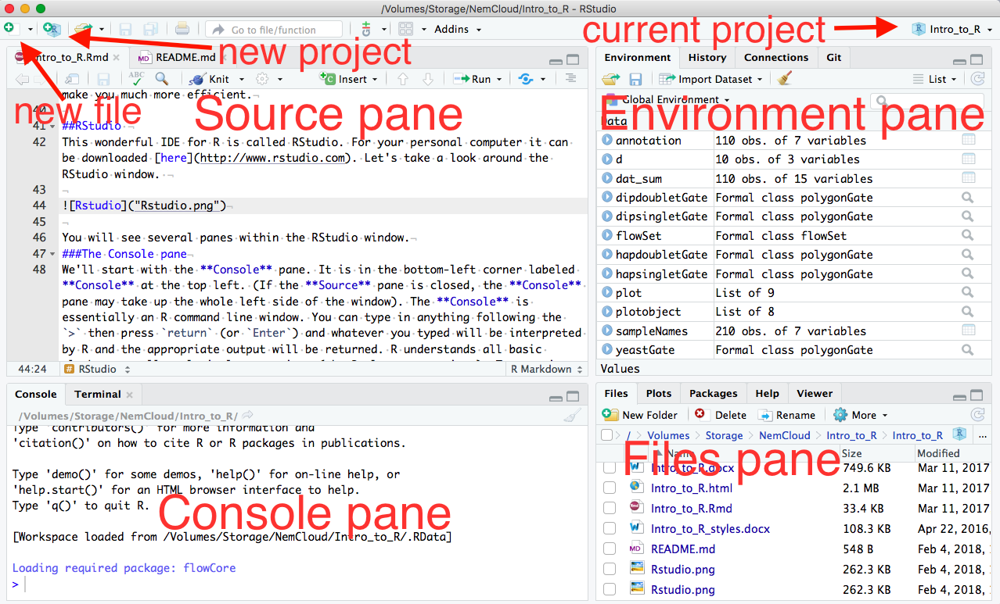
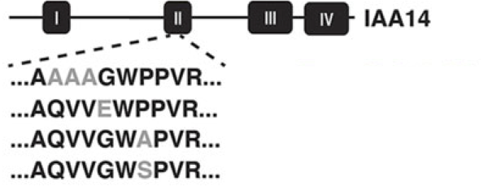
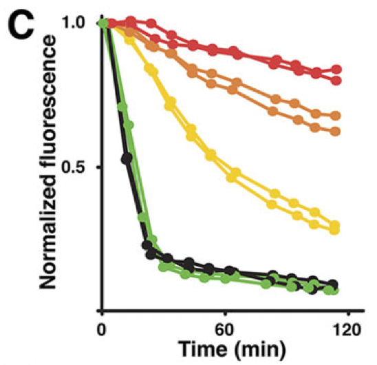
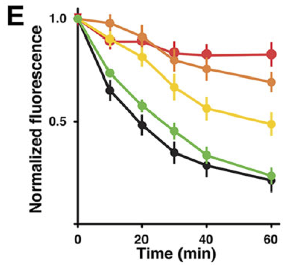

```{r setup, include=FALSE}
knitr::opts_chunk$set(comment = '#>')
```

#Using this document  
The goal of this particular tutorial is to teach you how to efficiently and effectively use RStudio to teach yourself how to do anything you may want to do with R. If you would like a more in-depth R tutorial check out [Code School](http://tryr.codeschool.com/).  

Keep in mind while navigating this tutorial that you are supposed to be experimenting with R, making mistakes, causing errors and figuring out why. Nothing you do in RStudio will break your computer. Coding is a trial-and-error process, especially as you are learning. Try anything! See what happens! Learn from everything!    

#####???Question???
Throughout the tutorial you will find several sections with this label followed by questions for you to answer. The answers to these questions or the methods by which you can find the answers have already been covered in the above sections. Replace the *answer here* text with your answer along with any code you may have used to arrive at that answer and or a plot you have produced. **Save this document and email it to yourself and/or save it on a flash drive or in your google drive.** You will be working on the same document on your own after class.

The text within this tutorial is formatted to differentiate code from dialog. `text that looks like this` is R code or keyboard commands. You can copy and paste this code into an R console and execute it. Within multiline blocks of code functions will be colored blue, comments will be colored green, strings will be teal and Booleans will be red. If you don't know what any of these terms mean yet, don't worry, we'll get to them. 

In some cases the output from the code will be included in blocks of code. This output will be prefixed with `#>`. Here's an example:

```{r}
print("This is the output from the code")
```

Let's get started!

#The R programming language
R is a programming language for statistical computing and graphics generation. R is based on an older statistical computing language called S. It is freely available and open source. It can be downloaded for your personal computer [here](http://www.r-project.org). 

R is a line-oriented language, meaning each line of code is run or interpreted independently (as opposed to C/C++/Java and other "compiled" languages, in which the  program must be run at a time). This makes R and other line-oriented languages easy to learn and understand, because you can quickly see the results of each line of code and experiment with changes to that line. 

Another of the many great things about R is its beautiful integrated development environment (IDE, a program that provides a clean work space and numerous tools to assist you in coding). A good IDE can make learning a language much easier, and even if you are an experienced coder a good IDE can make you much more efficient.

##RStudio 
This wonderful IDE for R is called RStudio. For your personal computer it can be downloaded [here](http://www.rstudio.com). Let's take a look around the RStudio window. You will see several panes within the RStudio window.




###The Source pane
We'll start with the **Source** pane. It is in the top left of the RStudio window. (If you don't see this pane, create a new `.R` file by pressing `shift + command(or ctrl) + N`, or click the universal 'New Document' icon and select 'R script'). **Source** shows the '.R' files containing the scripts (multiple lines of related code) with which you are currently working. This is where you will spend most of your time building and testing lines of code and then combining them to make scripts for data analysis. Type the following into your script.  

```{r, eval=FALSE}
2+2
9/3
3^3
2>3
2<3
```

To run a line of code from the **Source** pane you place your cursor anywhere in a line of code and press `command/ctrl + enter` (or use the "Run" button in the top right of the **Source** pane. This will copy your line of code into the console and execute it. If you want to run a fraction of a line of code you can select just the portion you want to run and press `command/ctrl + enter`. Go ahead and run these lines of code and let's see what happens in the **Console** pane.

###The Console pane
It is in the bottom-left corner labeled **Console** at the top left. (If the **Source** pane is closed, the **Console** pane may take up the whole left side of the window). The **Console** is essentially an R command line window. You can type in anything following the `>` then press `return` (or `Enter`) and whatever you typed will be interpreted by R and the appropriate output will be returned. R understands all basic algebra as well as logical expressions (aka Boolean expressions).

The `>` is the R command prompt. If you don't see this in the **Console** then that mean R is still running another command or is potentially asking you to answer a question. Make sure you see the command prompt before running more lines of code or you will potentially miss the output from these lines and/or any errors that may have occurred! 

In addition to being a basic calculator (as shown in our examples above), R can create and interpret functions or variables that can be assigned to and represented by words. Variables (any peice of data of any variety) will be single words possibly followed by a $ or square brackets [] if the variable is a matrix (more on those symbols later). Functions are followed by parentheses containing the arguments passed to the function.

####Variables and Functions 
R is an object oriented language like most other modern programming languages. This means we can use R to create abstracted objects that contain data (of any type, shape or size) called variables or procedures/methods (individual blocks of code) commonly called functions. There are numerous functions and datasets included in the base R installation. Also, as an open source language countless programmers in the R community have written useful functions and created useful datasets that are freely available in the form of R-packages (more on these later). You can also write your own! 

```{r, eval= FALSE}
iris
# iris is a variable representing a famous data set of iris flower morphology

print(x = "print() is a function")
# print() is a functions that prints the argument x in the console
# Here we have assigned "print() is a function" to the argument x
```

####Comments  
To prevent code from being executed, or take note about what your code does or how to use your code (like I have done above) you can make "comments" by prepending any text with a `#`.

####Tab-complete
One of the most helpful things about RStudio is that it has an auto-complete feature! Try typing `pri` into R-script in the **Source** pane. RStudio automatically provides you with a list of all the available functions and variables beginning with 'pri'! 

You can navigate this list using the arrow keys or your mouse. When you select a particular object, RStudio also gives you some information about that object. Navigate down to `print` (if there are multiple, select the one that has {base} at the far right) and press `tab`. You will see that RStudio has completed `print` in the console and added a set of parentheses because `print` is a function, `print()`. Now we can add arguments that this function will operate on, within the parentheses. But what does this function do? To figure out type `?print` in the **Console** and press `return`. This opens the documentation for this function in the **Help** pane. A `?` before any function name, or passing a function name to the `help()` function will do the same.

###The Help pane
This pane is essentially a browser window for R documentation. You can also search for functions or variables in R and all of the installed packages on your computer using the search box at the top. You can search within a documentation page using the *Find in Topic* box.

Using this pane you should be able to answer almost any question you have about any R function. 

All R documentation follows standard formatting. **Description** is pretty self explanatory. **Usage** demonstrates how you use the function, sometimes with specifics for different variable types. For `print` this shows us that `print` takes the input argument `x` (an argument is just variable that is used in a function). If `x` is a 'factor' or a 'table', `print` will also take some additional arguments. In the **Usage** section the default value of each argument is listed (e.g. `FALSE` is the default value for argument `quote`). A description of each argument is listed below in the **Arguments** section. **Value** is the type of data returned by the function. There are a few other self-explanatory sections and finally **Examples**. This is often one of the most useful sections as it shows you how to use the function. The code in **Examples** can be copied and pasted into the console and run. 

###The Files/Plots/Packages/Help/Viewer pane
The **Help** pane contains additional tabs that can also be quite helpful. **Files** allows you to navigate through folders on your computer and open files. **Plots** shows you the most recent plot your code has produced and allows you to save it. **Packages** allows you to install and load packages into memory (more about packages later). 

***
#####???Questions???
Choose any function (use `tab` complete to find one starting with your favorite letter) and open its documentation in the **Help** pane. What function did you choose? 
*answer here*

Copy the **Usage** section of your chosen function below.  
*answer here*

***

Additionally, there is a search engine specific to R resources including the documentation, blogs, books and questions users have asked on discussion boards. This invaluable resource is at [Rseek.org](http://rseek.org). This is especially helpful if you want to find a function to perform a specific task. 

####OK, back to the Source pane...
You should have `print()` in there now.   
Put your cursor in the middle of the parentheses and press `tab`. RStudio will feed you all of the arguments of this function using auto-complete! Press `tab` again and `x = ` will appear in the parentheses. Type `"hello world"` and press `command/ctrl + return`. 

```{r}
print(x = "hello world")
```

Take note that if you are missing the quotes around `hello world` R will look for a variable named `hello` and return an error.  

If your code didn't work, try to fix it and run it again. 

Now let's practice running a fraction of a line of code. Just highlight the `x = "hello world"` within the parentheses and press `command + return` (or `ctrl + enter`). You just created your first variable object in R! 

###The Environment pane
See, over on the top right next to `x` is "hello world". You can now execute just `print(x)`, and you will get `[1] "hello world"`! The **Environment** pane shows all of the objects you have created or stored in memory. You can view data sets or functions by clicking on them, but at the moment we only have the simple variable `x`. Don't worry, we'll practice viewing objects later.

##Variables and data types
You can create objects (variables~values, large data structures~think spreadsheets and databases, and functions~chunks of code) using the `=`, `<-` or `->` operators, to assign code or code results to an object name. 

*It is preferable to use the `<-` operator when creating objects as it keeps the object names on the left, and the `=` operator is used to assign argument values to functions, so we will reserve `=` for that.* 

You can see what type of data (or data type) a variable is using the `class` function. Go ahead, try running `class(x)`. Data in R can be of several different, basic types:

Data Type |aka        |Example
----------|-----------|---------
Logical   |Boolean    |TRUE, FALSE	
Numeric   |float      |42, 3.14, 	
Character |string     |'a' , "good", "TRUE", '23.4'
Integer   |           |2L, 34L, 0L	
Complex   |           |3 + 2i	
Raw	      |Hexadecimal|"Hello" is stored as 48 65 6c 6c 6f 

###Vectors
Vectors in R are simply ordered lists of values. These values can be of any type (strings, numerics, Boolean, etc), but they must all be of the same type, or R will force them to be the same. We can construct vectors using the `c()` function. 

Let's run through a quick example:
```{r}
example_vector <- c('plant', 'genotype')
example_vector
```

***
#####???Question???
What is `c` abbreviating? (i.e. what is the title of the `c()` function?)
*answer here*

What are the arguments that you can pass to `c()`?
*answer here*

***


Now we have a vector of strings. We can access the individual elements using the square bracket operator.
```{r}
example_vector[1]
example_vector[2]
#Note that the indices begin at 1 in R!!!
example_vector[0]
```
We can also change elements or add elements to the vector using the bracket operator.
```{r}
example_vector[2] <- 'phenotype'
example_vector[3] <- 'root_length'
example_vector
example_vector[4] <- FALSE
example_vector
```

***
#####???Question???  
What happened to FALSE (is it a boolean)? 
*answer here*

Write a block of code to test what would happen if we instead added a character string to a vector of logical values (i.e. make a new variable containing a few Boolean values, then add a string to that vector)! What happens? 
*answer here*
```{r, eval = F, echo = F}
bools <- c(FALSE, TRUE)
bools[3] <- 'hello'
bools
```
***  

### Matrices, Arrays and Lists
**Matrices** are simple two dimensional data sets and **Arrays** are N-dimensional data sets. Like vectors these must be made of a single data type. For more info `?matrix` and `?array`.

Lists are more complex data structures that are similar to vectors but allow multiple data types. Lists can contain vectors as elements and even other lists! This makes them potentially N-dimensional but clunky to work with. You might encounter them if you use R in the future. 
For more info `?list`.

###Data frames
Variables in R are not limited to just strings or integers or even matrices. You can store and operate on entire spreadsheets with fields of defined data types, using what R calls 'data frames'. The data frame is one of the most fundamental data structures used in R. `?data.frame` provides a wealth of knowledge about data frames, but let's just go ahead and make one! Run the following code.
```{r}
L3 <- LETTERS[1:3]
fac <- sample(x = L3, size = 10, replace = TRUE)
d <- data.frame(x = 1, y = 1:10, fac = fac)
#notice how the columns of the data frame can be named using '=', just as if we were creating individual vectors
d
class(d)
```
***
#####???Questions???  
What is `LETTERS`? What is L3?
*answer here*

What does `sample` do?
*answer here*

***
Now we have a data frame `d` with 10 rows and 3 columns. You can retrieve individual columns using the `$` operator. Try it, `d$fac`!. Wait a minute, why is this no longer a column? The columns of a data frame are actually just vectors.

***
#####???Question???
What class of data is `d$fac`? 
*answer here*

***

####Factors
Factors used to be an efficient way of storing large vectors of repetitive discrete or categorical data. Factors do this by translating the potentially long individual pieces of data into integers, using a table called levels. Try `levels(d$fac)`. So R will use this key with 1 = A, 2 = B, 3 = C, to read and write this factor. To see how R sees `d$fac` we can use `as.integer(d$fac)`. R now stores large data structures by indexing values like this regardless of whether it's a factor of not. Despite this fact there are still some useful features of factors. 

For one, factors can only take on values within the `levels` vector. This means that if you are manually entering things like genotype as you are collecting your data, R can help alert you to spelling mistakes. 

Giving `?factor` a look, you will see that we can also assign a particular order to the levels of a factor. This can be handy for ordering variables when plotting. We can also assign labels to the levels, just in case your level names are too abstracted to be understandable. 

However when manipulating data frames containing factors you must be careful because some functions may interpret factors as their integer values! We could also avoid creating a factor in our data frame and just keep this column as characters by including `stringsAsFactors = F` in our call to `data.frame()`.

###Back to data frames
Going back to our data frame `d`, similar to vectors we can access rows, columns and elements of the data frame using the square bracket operator. I'll suppress the output below and let you run these examples yourself. 
```{r, eval = F}
#get the first row of d
d[1,]
#get the first column of d
d[,1]
#get the column named 'fac'
d[,'fac']
#or
d[['fac']]
#or (most efficient and readable)
d$fac
#get the element in the 5th row and 3rd column
d[5,3]
```
We can also perform calculations or other operations on the elements of a data frame.
```{r, eval = F}
d[,2] + 1
d[[2]] + 1
d[,2] * 2
#similarly for logical operations, note that logical 'is equivalent to' is '=='
d[,3] == 'B'
d$y <= 5

#we can also use functions to perform complex calculations
mean(d$y)
median(d$y)
sum(d$y)
```
Just like with vectors we can change elements or add elements to a data frame. 

***
#####???Question???
How would you add a column to `d` with the integer values representing `d$fac`? 
*answer here*

What is the mean of your new column of `d`? Copy the code you used.
*answer here*

What is the median or your new column of `d`?  Copy the code you used.
*answer here*

What is the sum of your new column?  Copy the code you used.
*answer here*

What fraction of the sum of your new column is each row's value? Make a new column for `d` showing this fraction. Copy the code you used.
*answer here*

***

#Data analysis and visualization

Enough with these toy examples, let's look at some real data! Below we will analyze some real data from today's reading [Guseman et al. 2015](http://dx.doi.org/10.1242/dev.117234). The Nemhauser lab has pioneered a technique by which plant signaling network dynamics can be measured in yeast using flow cytometry. The genes constituting these signaling networks are expressed in yeast and potentially fused with a fluorescent protein to allow dynamic measurement. Liquid cultures of yeast expressing these signaling proteins can be stimulated with the input signal and the response of the tagged proteins can then be measured using flow cytometry.

R provides convenient functions for reading data of many types into memory. These functions include `read.csv` and `read.table` along with many others. R also has several packages of functions for analyzing flow cytometry data. 

####Flow Cytometry
As you might remember from digging deep into the methods of last weeks reading, [Havens et al. 2012](http://dx.doi.org/10.1104/pp.112.202184), flow cytometry measures light scattering, absorption, and emission of single cells, by passing a stream of cells through the path of a laser in rapid succession. Light scattered from the laser beam is detected as a pulse beginning when the cell enters the laser beam peaking when the cell is centered in the beam, and ending when the cell leaves the beam. The cytometer collects the maximum height of the signal from this pulse (H), the total area of the pulse (A) and the width of the pulse (W). Light is scattered in all directions as the cell passes through the beam and how much light is scattered and in what direction can tell us a lot about a cell. Typically, light that passes through the cell is measured as forward-scattered light or 'FSC' and this is considered proportional to a cells size. The cell actually acts as a lens bending the light, therefore the smaller the cell the more light is bent away from the forward-scatter detector, whereas larger cells allow more light to pass straight through. Dead cells appear very low on the FSC axis.  

Side-scattered light or 'SSC' is the light that is reflected perpendicular, or at a wide angle, relative to the laser beam. SSC is proportional to the internal complexity, or granularity, of the cell. Imagine all of those tiny, circuitous, membrane-bound organelles acting as little lenses bending light in all sorts of directions. 

Similarly side-scattered light at different wavelengths from the laser is collected as a measure of the fluorescence of the cell. Because light is scattered at all angles you can measure fluorescence at many wavelengths. For our example experiment below, the fluorescence of the Aux/IAA-fluorescent-protein fusion is detected as 'FL1'. 

Let's take a quick look at what this raw flow cytometry data looks like.

```{r, echo = FALSE}
library(flowCore)
library(flowViz)
library(lattice)
flowSet <- read.flowSet(path = 'flowSet', alter.names = T)
```


```{r, echo=FALSE, warning=FALSE}
xyplot(SSC.H~FSC.H, data = flowSet[['0_A01.fcs']], xlim = c(0, 6E6), ylim = c(0, 6E5), smooth = F)
```
Here is a plot of the side-scatter versus the forward scatter. Each dot represents a single cell. This approximates a plot of cell granularity on the y-axis vs. cell diameter on the X-axis.   

```{r, echo = FALSE}
xyplot(FL1.A~FSC.H, data = flowSet[['0_A01.fcs']], xlim = c(0, 6E6), ylim = c(0,2E4), smooth = F)
```
Here is a plot of fluorescence, in this case the fluorescence of the Aux/IAA-YFP fusion protein that is used to measure auxin signal transduction. Notice that in the larger cells the fluorscence gets more variable. That's because these cells are older or are potentially clumps of cells. Lets look a a histogram of the fluorescence.   


```{r, echo=FALSE}
histogram(~FL1.A, data = flowSet[['0_A01.fcs']], xlim = c(0,1E4), margin = F, type = 'count', breaks = 500)
```
The histogram shows the number of yeast cells that have Fl1.A values within each bin of a set size across the entire range of FL1.A values. This gives us an idea of the distribution of FL1.A values.

***  
#####???Question???  
Just by eye, what would you estimate as the mean (the average value) of the above FL1.A distribution?
*answer here*

Here is a histogram plot of the same strain we plotted above, but after it has been treated with 10 uM auxin.  
```{r}
histogram(~FL1.A, data = flowSet[['3_F01.fcs']], xlim = c(0,1E4), margin = F, type = 'count', breaks = 500)
```


Again just by eye, what is the mean of this distribution? How has the distribution changed? Is this what you would expect?
*answer here*

***

Before we start exploring this data using graphically, we summarize the distribution of fluorescence in each well (that is for each time point and treatment), by calculating the mean, median and standard deviation of the FL1.A distributions for each well. To get the most precise measurement of auxin signaling, we also want to only include the healthy single cells in this calculation based on the FSC and SSC values (essentially only the red, yellow and light green cells in the SSC vs FSC graph above). These FSC and SSC values have been set by earlier experiments and are called 'gates'. 

We've done this calculation for you because it requires you to download several packages that takes a lot of time. 

##Importing and exporting data

Download "Guseman_et_al_cyto_data.csv" from the Canvas webpage into the "Downloads" folder, or another folder of your choosing. Just remember the path to the file, we'll need it to read the data into R. To read data into R we typically use the `read.csv()` or `read.table()` functions to read in spreadsheets that might have been generated by an instrument, in Excel or in R. The only argument we need to provide is the path to the file as a string (i.e. in quotes). You can always provide the full path to the file, or you can also provide the path relative to your current working directory. You can figure out what the current working directory of your R session is using the `getwd()` function. This function doesn't take any arguments. You can change the working directory using `setwd()`. You can also use the **Files** pane to find your file, and the More button will allow you to Go To Working Directory and Set As Working Directory. Let's read in this data set as an object called `dat_sum`.

```{r, eval = FALSE}
dat_sum <- read.csv("~/Downloads/Guseman_et_al_cyto_data.csv")
```
```{r, echo=FALSE}
dat_sum <- read.csv("~/Desktop/Intro_to_R/Guseman_et_al_cyto_data.csv")
```

***
#####???Questions???
What data type is `dat_sum`?
*answer here*

What are the column names of `dat_sum`?
*answer here*


Write a line of code to figure out the column names of the dataset.
*answer here*

***

##Very basic data wrangling

In this data frame `strain` includes IAA14 and several mutant variants of IAA14 each fused to a fluorescent protein. We can see the list of possible strains using the code below.
```{r}
unique(dat_sum$strain)
```

***
#####???Questions???  
What is the AFB used in this experiment?
*answer here*

What are the treatments used? What information about this experiment is missing from this data set?
*answer here*

***

In this experiment a culture of each strain was treated with 10 uM auxin and another identical culture was treated with 0 uM auxin as the control. This treatment was done at the time that well 2_A01 was being read. We typically set the time at which the cultures were treated with hormone as T=0. 

We can set time to zero when auxin was added, the time when well 2_A01 was read, using the following code.
```{r}
#get the time when 2_A01 was read
T0 <- dat_sum[which(dat_sum$file == '2_A01'), "time"]
#subtract this time from the time column of dat_sum
dat_sum$time <- dat_sum$time - T0
```

The auxin here, as you know, induces the binding of the F-box protein, TIR1 along with it's associated SCF ubiquitin ligase complex to the IAA proteins. The binding of IAA proteins to SCF^TIR1^ allows ubiquitin to be transferred to the IAA. The ubiquitinated IAA is then degraded by the proteasome along with it's fluorescent label. Using flow cytometry, the amount of fluorescently-labelled IAA in each of the cultures was measured once every 10-15 minutes. What culture was measured in each well is recorded in the data set along with the time at which each well was read (which is recorded by the cytometer). 

Finally, before we graph this data let's make a hypothesis about what effect these mutations will have. Going back to our earlier code:
```{r}
unique(dat_sum$strain)
```
This experiment is comparing the degradation rate of IAA14, IAA14 G79E (this means that the glycine residue at position 79 has been mutated to glutamate), IAA14 P81A, IAA14 P81S, and IAA14 3A (which has three alanines replacing residues 76-78) in the presence of TIR1 and 10 uM auxin.  


***
#####???Questions???
Based on your knowledge of auxin signaling and amino acid structures hypothesize the order of their degradation rates.
*answer here*

***

##Visualizing data

First, let's install a popular graphing package so we can analyze this data and make beautiful graphs to illustrate the resuts of this experiment. 

###Packages

There are three places where R packages are available:  
1. [CRAN](http://cran.r-project.org/web/packages/) contains a huge variety of general packages,  
2. [bioConductor](http://bioconductor.org/) contains packages related to high throughput biological (mostly -omics) data,  
3. Packages in development may be available from code repositories such as [GitHub](http://github.com),  [Bitbucket](http://bitbucket.org) or others. 

We'll install the 'ggplot2' package from CRAN
```{r, eval= F}
#install a package from CRAN (if you exclude the 'repos' argument it may return a list and ask you to select a repository server)
install.packages('ggplot2')
```
```{r}
#before using the package we must load it into our workspace
library('ggplot2')
```

The 'gg' in `ggplot2` stands for 'grammar of graphics'. This grammar allows us to map data to visual representations in a manner similar to how language maps words to abstract concepts. The grammar of graphics allows precise control over each item in a graph, and also provides convenient defaults.  The `qplot` function uses these default values to make quick plots. 

Let's explore this data a bit using the `qplot` function.
```{r}
qplot(time, y = FL1.Amean, data = dat_sum, color = strain)
```

***
#####???Questions???
What key piece of data is left out of the above graph?
*answer here*

```{r, eval = F}
qplot(time, y = FL1.Amean, data = dat_sum, color = strain, shape = treatment)
```
What is causing the error returned by running the above line of code? What does this mean?
*answer here*

```{r, echo=F, eval = F}
*The continuous variable `treatment` cannot be mapped to shape, which is a discrete set of shapes. A continuous variable can take on an infinite number of values whereas a discrete variable can only take on a set number of possible values. Because `treatment` is a numeric variable here it is continuous and therefore cannot be mapped by the discrete set `shape`.*
```

***

```{r}
qplot(x = time, y = FL1.Amean, data = dat_sum, color = strain, shape = as.factor(treatment))
```

Within the grammar of graphics aesthetics are visual parameters to which you can map a variable. So for example here, `x`, `y`, `color` and `shape` are aesthetics to which we have mapped the variables `time`, `FL1.Amean`, `strain` and `treatment`. If we extend the language grammar metaphor, aesthetics are like nouns, you can have several nouns in a sentence. But we also need a verb to make a sentence, right? The verb-equivalents in the grammar of graphics are called geometries. These geometries are the methods of representing data, e.g. bar plots, scatter plots, and box-and-whisker plots. In `ggplot2` these geometries are created using which always begin with `geom_`, so you can type 'geom' into the **Help** pane and see a list of all the possibilities. 

***  
#####???Question???  
What is the default `geom` argument in the above call to `qplot`?
*answer here*

Try using a different `geom` argument in the above line.
*answer here*

Does this improve how the data is visualized? Why or why not?  
*answer here*

***

The more advanced plotting function in `ggplot2` is `ggplot()`. `?ggplot`


***  
#####???Question???  
What are the arguments of `ggplot`?
*answer here*

***

So `ggplot` sets up the aesthetic mapping (the axes and other "dimensions" like color, shape and linetype), then we can add geoms to this `ggplot` aesthetic to put data on the plot. Let's try to recreate the plot from above to help solidify this idea.

```{r}
#set up the aesthetic mapping, note that we have to put this within an aes function
plot <- ggplot(data = dat_sum, mapping = aes(x = time, y = FL1.Amean, color = strain, shape = as.factor(treatment)))
#now we can add to this a point geom
plot <- plot + geom_point()
#and finally visualize the plot
plot
```

###Making your plots easily understandable

All of the dots in the figure make it quite busy, perhaps a line connecting the dots would help show the trends. We can simply add a line geometry to the `plot` object, and R will add this layer to the graph.
```{r}
plot <- plot + geom_line()
plot
```
This is easier to visualize, but our graph is still not very easy to understand for anyone who doesn't know our experimental methods. 

***
#####???Questions???
What would you change about this graph or add to it, to make it more immediately understandable?
*answer here*

***

One issue is that all of the titles are taken directly from our data frame. It would be much better to translate these variable names into plain English. Let's start with the axis titles. 
```{r}
plot <- plot + labs(x = 'Time post auxin addition (minutes)', y = 'Fluorescence of IAAx-YFP fusion (AU)')
plot
```

Similarly, we can change the titles of the legends using the aesthetics we have mapped the variables to as parameters to labels.

***
#####???Questions??? 
Change the legend titles such that they provide full information about the variables they are showing (don't forget units). Copy the code and the final graph below.  
*answer here* 

What would you title this graph? Try to fully describe the experiment as concisely as possible.   
*answer here*

Use `ggtitle()` to add a main title to the graph. Copy the code and graph below.  
*answer here*

***

Wow, that looks great! But there is still one last thing. Remember from the **Factors** section how we could add a label to each level of our factors? Let's use this to make the factor `dat_sum$strain` more descriptive.

```{r}
levels(dat_sum$strain)
dat_sum$strain <- factor(dat_sum$strain, levels = levels(dat_sum$strain), labels = c('IAA14', 'IAA14-3A', "IAA14-G79E","IAA14-P81A","IAA14-P81S"))
#note that the labels vector must be in the same order as the levels vector
```
Now that we have changed the data we need to reassemble the plot from scratch.
```{r}
plot <- ggplot(data = dat_sum, mapping = aes(x = time, y = FL1.Amean, color = strain, shape = as.factor(treatment))) + geom_point() + geom_line() + labs(x = 'Time (minutes)', y = 'Fluorescence of IAAx-YFP fusion (AU)') #add your legend labels in here
```

***
#####???Questions???
What is the difference between our graph and figure 1C from Guseman et al.?  
*answer here*

What is the difference between figures 1C and 1E from Guseman et al.?  
*answer here*

What do the authors conclude based on these two figures?  
*answer here*

***
